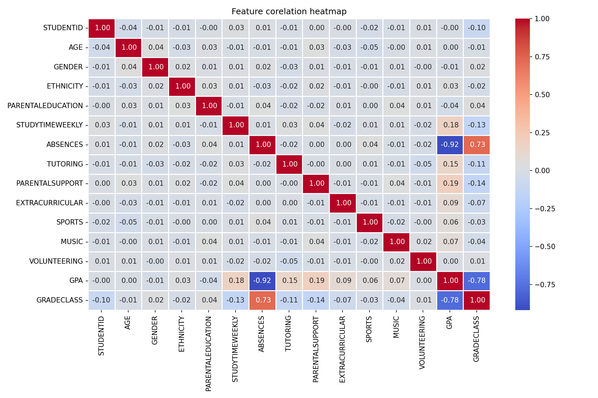
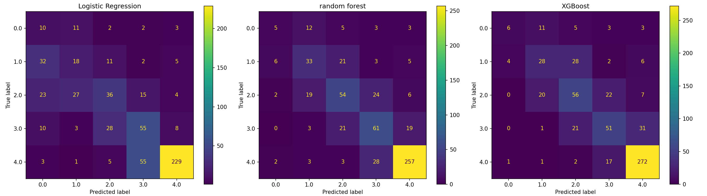
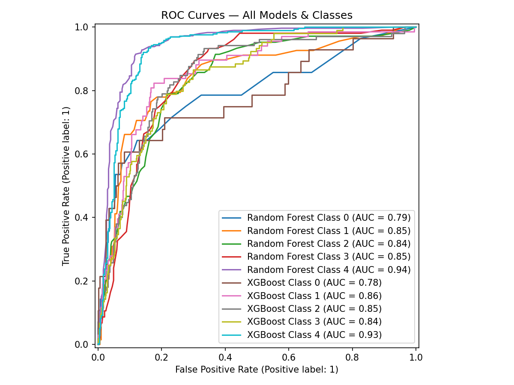
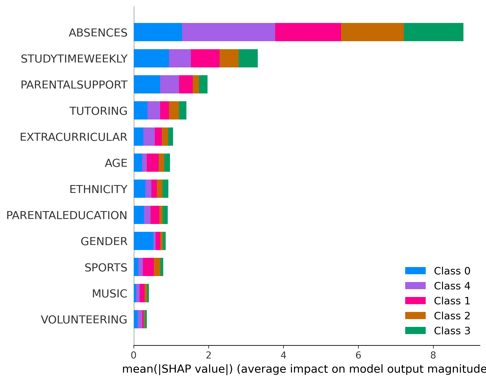
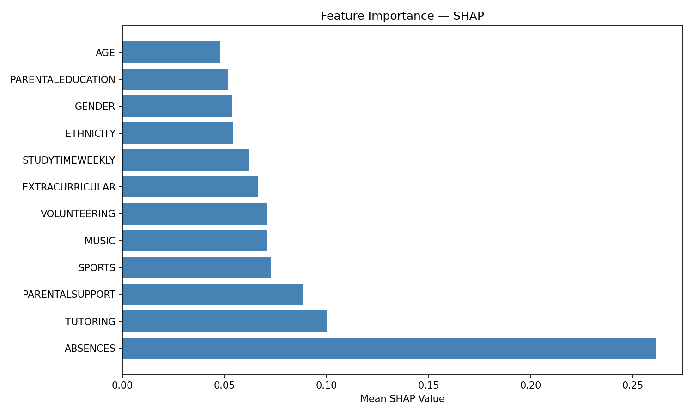

# Student Performance Prediction & Explainability System

An end-to-end machine learning pipeline to predict student academic performance across 5 grade classes using behavioural and demographic features, with SHAP-based model explainability.

---

## Results Summary

| Model | Accuracy | Macro F1 | ROC-AUC |
|---|---|---|---|
| Logistic Regression | 58% | 0.43 | — |
| Random Forest | 68.6% | 0.53 | 0.854 |
| XGBoost | 69.1% | 0.53 | 0.853 |

**Best model: XGBoost** — highest accuracy and strongest performance on minority classes (GradeClass 0/A).

---

## Key Finding

Both correlation analysis and SHAP explainability independently identified **Absences** as the strongest predictor of student grade class. Students with high absenteeism were overwhelmingly concentrated in GradeClass 4 (F), while StudyTimeWeekly and ParentalSupport emerged as the next most impactful behavioural factors. Demographic features (Age, Gender, Ethnicity) showed near-zero importance — suggesting academic behaviour matters far more than background.

---

## Dataset

- **Source:** [Students Performance Dataset — Kaggle (Rabie El Kharoua)](https://www.kaggle.com/datasets/rabieelkharoua/students-performance-dataset)
- **Size:** 2392 students, 12 features after preprocessing
- **Target:** GradeClass (0=A, 1=B, 2=C, 3=D, 4=F)
- **Class distribution:** Heavily imbalanced — 51% GradeClass 4 (F)

---

## Tech Stack

- **Language:** Python
- **Data:** Pandas, NumPy
- **Visualization:** Matplotlib, Seaborn
- **Modelling:** Scikit-learn, XGBoost
- **Explainability:** SHAP
- **Environment:** Jupyter Notebook

---

## Project Structure

```
student-performance-predictor/
│
├── notebook.ipynb          # Main notebook — EDA, modelling, SHAP
├── dataset/
│   └── student_performance.csv
├── plots/
│   ├── correlation_heatmap.png
│   ├── confusion_matrices.png
│   ├── roc_curves.png
│   ├── shap_summary.png
│   └── shap_feature_importance.png
└── README.md
```

---

## Methodology

### 1. Exploratory Data Analysis
- Inspected data types, missing values, and distributions
- Correlation heatmap revealed Absences (r=+0.73) as strongest predictor after removing leakage columns
- GPA (r=-0.78) and Result dropped — both directly derived from GradeClass (target leakage)

### 2. Preprocessing
- Dropped leakage columns: GPA, Result, StudentID
- 80/20 train-test split (random_state=42)
- StandardScaler applied — fitted on training data only to prevent leakage
- Class imbalance handled via class_weight='balanced'

### 3. Model Training
Three models trained and compared:
- **Logistic Regression** — linear baseline
- **Random Forest** — ensemble of 100 decision trees
- **XGBoost** — gradient boosting, multiclass configuration

### 4. Evaluation
Given 51% class imbalance, accuracy alone is misleading — a naive model predicting F every time achieves 51%. **F1-score and ROC-AUC used as primary metrics.**

XGBoost achieved 0.853 ROC-AUC, indicating strong class separation on this imbalanced 5-class problem.

### 5. SHAP Explainability
SHAP (SHapley Additive exPlanations) applied to XGBoost to interpret predictions globally and locally:
- **Global:** Summary plot and feature importance bar chart
- **Local:** Force plot for individual student prediction

SHAP confirmed Absences as dominant predictor, consistent with EDA findings.

---

## Visualizations

### Correlation Heatmap


### Confusion Matrices


### ROC Curves


### SHAP Summary Plot


### SHAP Feature Importance


---

## How to Run

```bash
# Clone the repository
git clone https://github.com/Arihant-Golchha/Student-Performance-Predictor.git
cd Student-Performance-Predictor

# Install dependencies
pip install -r requirements.txt

# Launch notebook
jupyter notebook notebook.ipynb
```

---

## Conclusion

This pipeline demonstrates that student academic performance can be predicted with 69% accuracy and 0.853 ROC-AUC using purely behavioural features. SHAP analysis confirms Absences as the strongest predictor, with StudyTimeWeekly and ParentalSupport as secondary factors. Demographic features contribute minimally — suggesting interventions should focus on attendance and study habits rather than background characteristics.

---

## Author

**Arihant Golchha**  
B.E. Artificial Intelligence & Data Science — MBM University, Jodhpur  
[GitHub](https://github.com/Arihant-Golchha) | [LinkedIn](#) | [LeetCode](#)